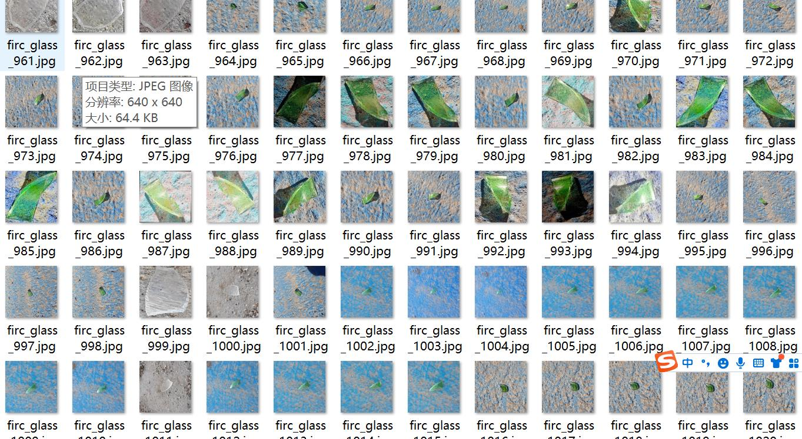
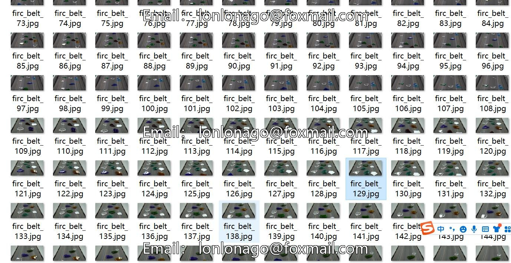
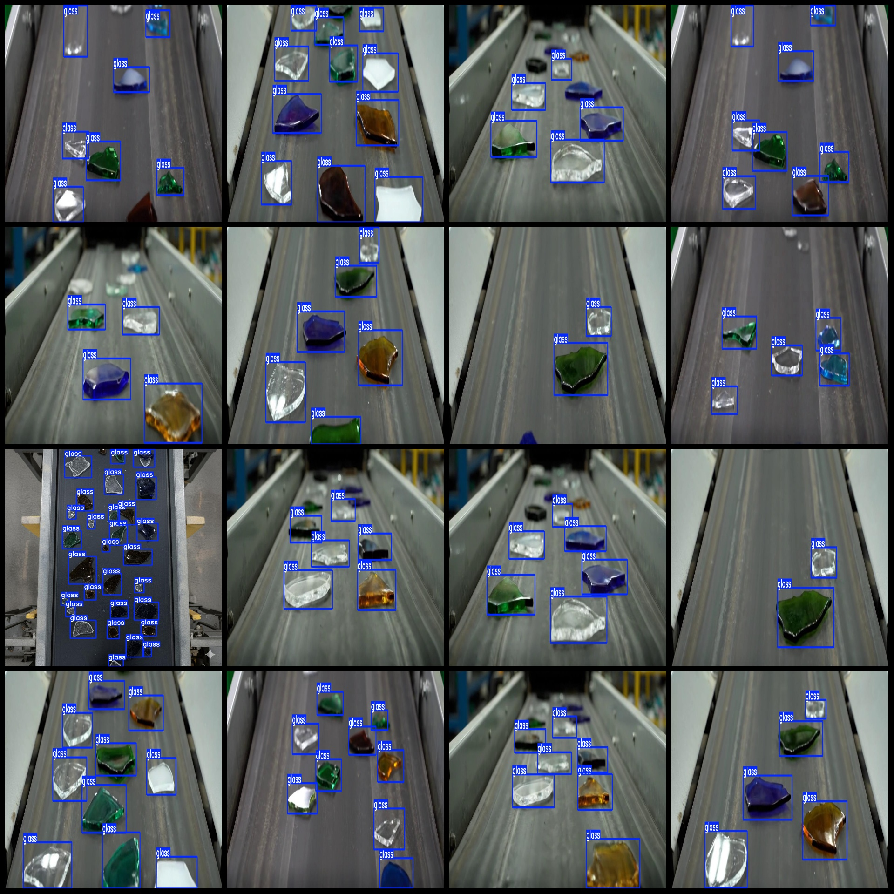
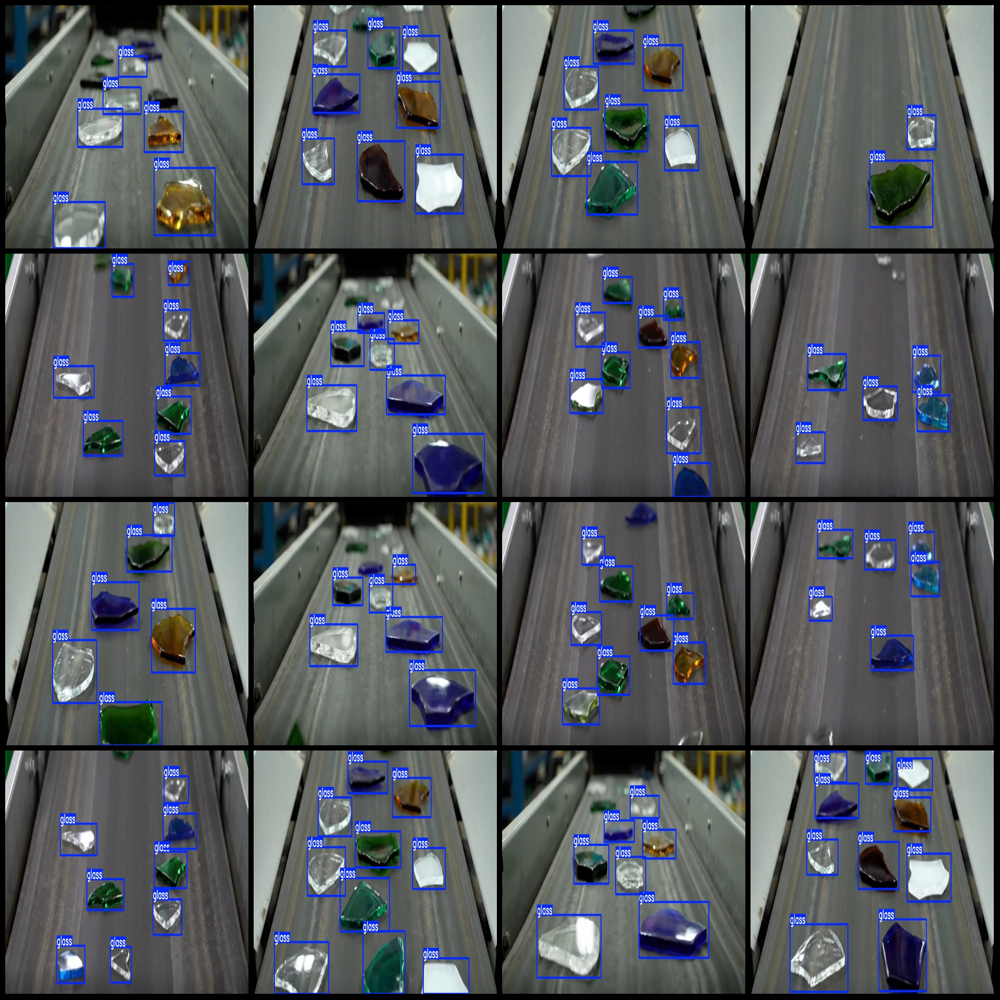

# 156 Detecting Glass Shards on a conveyor belt using YOLOv3+VOC++ format

Dataset format: Pascal VOC format + YOLO format (txt files without split paths, only containing jpg images and corresponding VOC format xml files and yolo format txt files)
Number of images (jpg file count): 156
Number of annotations (xml file count): 156
Number of annotations (txt file count): 156
Number of annotation categories: 1
Annotation category names: ["glass"]
Number of bounding boxes for each category:
- Glass bounding box count = 1225
Total bounding boxes: 1225
Image resolution: 1280x600
Labeling tool used: labelImg
Annotation rule: Draw a bounding box for the category
Important note: No special statement.
Special declaration: This dataset does not guarantee the accuracy of trained models or weight files.
Preview of images:
## Images

Here is a pay link on Stripe ( https://buy.stripe.com/3cs8yP7sY87d0vu9AB ). Please contact me lonlonago@foxmail.com after funding $89, and I will send you a complete data files , thank you!

